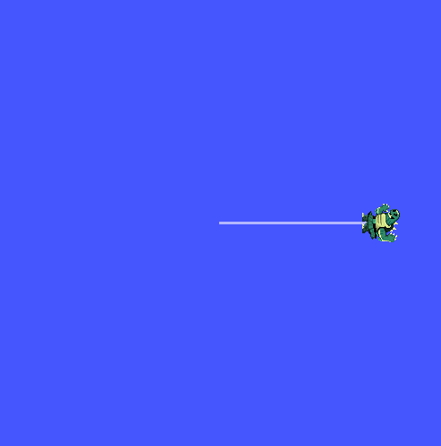

# ПР01. Граф ROS 2 и разрыв связи между доменами

Дата опыта: **10 сентября 2026 года**. Среда — один Docker-контейнер
`pr01-student-demo`, Ubuntu 26.04, ROS 2 Lyrical. Окно turtlesim работало на
реальном X11-дисплее. Нажатия ↑ передавались как клавиатурные escape-последовательности
в PTY запущенной `turtle_teleop_key`; команды движения публиковала сама teleop-нода.

[Версии среды](environment.json) · [ROS Doctor](doctor.txt) ·
[Порядок повторения](../../README.md)

## 1. Исправная система

Терминал A: `ROS_DOMAIN_ID=16`, запущен `ros2 run turtlesim turtlesim_node`.
Терминал B: `ROS_DOMAIN_ID=16`, запущен `ros2 run turtlesim turtle_teleop_key`.
Терминал C: `ROS_DOMAIN_ID=16`, команды наблюдения. Все три терминала находятся
в одной среде ROS; контейнер использует отдельную bridge-сеть.

Команда `ros2 node list --no-daemon --spin-time 2` вернула:

```text
/teleop_turtle
/turtlesim
```

Полный вывод: [nodes-before.txt](nodes-before.txt).

| Нода | Роль |
|---|---|
| `/teleop_turtle` | Читает клавиши терминала и публикует команду скорости |
| `/turtlesim` | Принимает скорость, двигает черепаху, публикует позу и цвет под ней |

Командой `ros2 node info` проверены интерфейсы
[/turtlesim](turtlesim-info.txt) и [/teleop_turtle](teleop-info.txt).
Издатель `/turtle1/cmd_vel` — teleop, подписчик — turtlesim.

### Топики и типы

`ros2 topic list -t` дал следующий список:

```text
/parameter_events [rcl_interfaces/msg/ParameterEvent]
/rosout [rcl_interfaces/msg/Log]
/turtle1/cmd_vel [geometry_msgs/msg/Twist]
/turtle1/color_sensor [turtlesim_msgs/msg/Color]
/turtle1/pose [turtlesim_msgs/msg/Pose]
```

Полный вывод: [topics.txt](topics.txt).

| Топик | Издатель → получатель в этом опыте | Назначение |
|---|---|---|
| `/turtle1/cmd_vel` | `/teleop_turtle` → `/turtlesim` | Линейная и угловая скорость |
| `/turtle1/pose` | `/turtlesim` → временные CLI-подписчики `echo` и `hz` | Положение, угол и скорости |
| `/turtle1/color_sensor` | `/turtlesim` → в опыте не использован | Цвет под черепахой |
| `/parameter_events` | Обе ноды; у `/turtlesim` также есть подписка | События параметров |
| `/rosout` | Обе ноды → отдельного подписчика не запускал | Служебные логи |

CLI-подписчики существуют только пока выполняется соответствующая команда.
Поэтому в исходном `node list`, снятом до `echo` и `hz`, их нет.
Teleop не подписывается на позу: для клавиатурного управления эта обратная связь
ему не нужна.

### Схема основных потоков

```text
клавиша ↑
    │
    ▼
/teleop_turtle
    │  /turtle1/cmd_vel [geometry_msgs/msg/Twist]
    ▼
/turtlesim ──► окно: движение и след черепахи
    │  /turtle1/pose [turtlesim_msgs/msg/Pose]
    ├──► ros2 topic echo … --once   (одна поза)
    └──► ros2 topic hz …            (частота сообщений)
```

`ros2 topic type /turtle1/pose` вернула `turtlesim_msgs/msg/Pose`
([pose-type.txt](pose-type.txt)). Это тип установленной Lyrical.

### Получение позы и движение

До нажатий `ros2 topic echo /turtle1/pose --once` получила:

```yaml
x: 5.544444561004639
y: 5.544444561004639
theta: 0.0
linear_velocity: 0.0
angular_velocity: 0.0
```

После одного ↑ и остановки черепахи `x` стала `7.560444355010986`,
`y` и `theta` не изменились. Смещение по x составило примерно 2,016 единицы
turtlesim. Значит, наличие нод подтверждено и фактическим движением.

Первичные записи: [до клавиши](pose-before.txt),
[после клавиши в исправном домене](pose-after-key-working.txt).
На момент снятия поз обе скорости уже равны нулю: нода turtlesim останавливает
движение, если новые команды не приходят.

## 2. Частота /turtle1/pose

Команда замера:

```bash
timeout --signal=INT 15s ros2 topic hz /turtle1/pose
```

Замер выполнялся до нажатий, когда черепаха стояла. Полное время команды
по таймеру Bash — **15,262 с**, включая запуск и завершение CLI.
Последняя строка измерения:

```text
average rate: 62.497
    min: 0.015s max: 0.016s std dev: 0.00040s window: 811
```

Это близко к ориентиру 62,5 Гц для периода 16 мс. Поза публикуется и у
неподвижной черепахи. Менять частоту или искать нагрузочную проблему по этому
замеру не потребовалось.

[Полный вывод hz](pose-hz.txt) · [длительность](pose-hz-duration.txt) ·
[код завершения](pose-hz-exit.txt). Здесь `exit=124` вызван намеренным
ограничением длительности замера. В отличие от опыта ниже, сообщения
**поступали**: они отражены в статистике `hz`.

## 3. Разрыв домена

A оставлен работающим в домене 16. В B остановлен teleop через `Ctrl+C`,
затем выполнены:

```bash
export ROS_DOMAIN_ID=17
ros2 run turtlesim turtle_teleop_key
```

В C установлен домен 17. `node list --no-daemon --spin-time 2` обнаружил
только `/teleop_turtle` ([nodes-broken.txt](nodes-broken.txt)). Симулятор
продолжал работать и оставался виден в своём домене.

В C проверка выполнена с явно сохранённым типом:

```bash
POSE_TYPE=turtlesim_msgs/msg/Pose
timeout 5s ros2 topic echo /turtle1/pose "$POSE_TYPE" --once
```

Результат — **`exit=124`**, сообщение Pose не получено. В
[pose-broken.txt](pose-broken.txt) осталась только служебная строка
`!rclpy.ok()` при завершении процесса; это не сообщение с координатами.
[Код возврата](pose-broken-exit.txt) записан сразу после `timeout`.

Клавиша ↑ в B не сдвинула черепаху. Для проверки положения использовано
дополнительное чтение из рабочего домена:

```bash
ROS_DOMAIN_ID=16 ros2 topic echo /turtle1/pose --once
```

Это отдельный контрольный подписчик в домене симулятора, а не успешный
результат сломанного теста в домене 17. Он показал прежние
`x=7.560444355010986`, `y=5.544444561004639`, `theta=0`:
[контрольная поза](pose-after-key-broken-control.txt).

## 4. Восстановление и сравнение

В B teleop остановлен и повторно запущен с `ROS_DOMAIN_ID=16`.
В C также возвращён домен 16. Повторена **та же команда** с тем же типом
и таймаутом 5 секунд; изменились только домен и имя выходного файла.

Теперь видны обе ноды ([nodes-fixed.txt](nodes-fixed.txt)), получена
[поза](pose-fixed.txt), [код завершения](pose-fixed-exit.txt) — **`exit=0`**.
После нового нажатия ↑ координата `x` выросла до `9.576444625854492`:
[поза после восстановленного управления](pose-after-key-fixed.txt).

| Проверка | Исправно | Разрыв | Восстановлено |
|---|---|---|---|
| Домен A / B / C | 16 / 16 / 16 | 16 / 17 / 17 | 16 / 16 / 16 |
| Ноды, видимые в C | teleop и turtlesim | Только teleop | teleop и turtlesim |
| Получение позы в C | Поза получена | Таймаут 5 с, код 124 | Поза получена, код 0 |
| x после ↑ | 7,560444 | 7,560444 — не изменилась | 9,576445 |
| Управление | Работает | Не работает | Работает |

### Причина

Домен задаёт область обнаружения ROS-участников. Teleop в домене 17 не
обнаруживает подписчика команд симулятора из домена 16; CLI-подписчик позы
в домене 17 также не обнаруживает издателя. Совпадения имени топика и типа
недостаточно для обмена между этими доменами.

`export ROS_DOMAIN_ID=…` меняет окружение оболочки и будущих процессов.
Уже запущенный teleop не получает новое значение, поэтому его нужно
остановить и запустить заново. Симулятор A всё время оставался в домене 16;
его процесс, установка ROS, имена топиков и тип сообщений не изменялись.
Возврата B и C в его домен оказалось достаточно: доставка и управление
восстановились в тех же проверках.

## 5. Снимки окна

[До движения](before.png) ·
[После клавиши из чужого домена](broken.png)

После восстановления связи и повторного ↑:



Снимки относятся к этому запуску. Основные доказательства — сохранённые
сообщения, код таймаута и сравнение поз; один скриншот не подтверждает домен.
